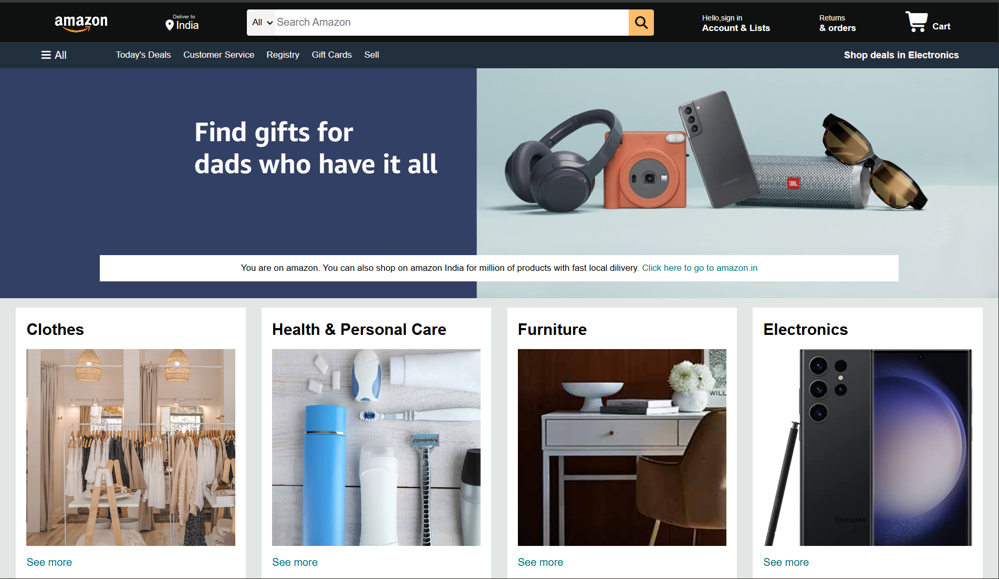
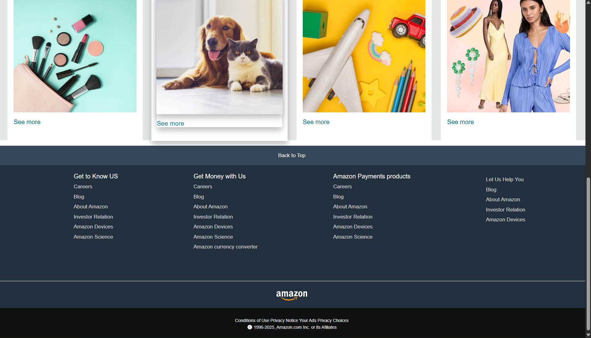

# 🛒 Amazon Front Page Clone

This project is a simple **Amazon front page clone** built using **HTML and CSS**.  
The goal was to practice frontend development skills such as **layout design, responsiveness, and styling**.

---

## media

</img>
</img>

## 🚀 Features

- Amazon-like **header navigation** (logo, search bar, sign-in, cart).
- **Hero section** with promotional banner.
- **Product categories** with images and hover effects.
- **Footer** similar to Amazon with multiple columns.
- Fully styled using **only CSS** (no frameworks).

---

## 🛠️ Technologies Used

- **HTML5** for structure  
- **CSS3** for styling (flexbox, grid, hover effects)

---

